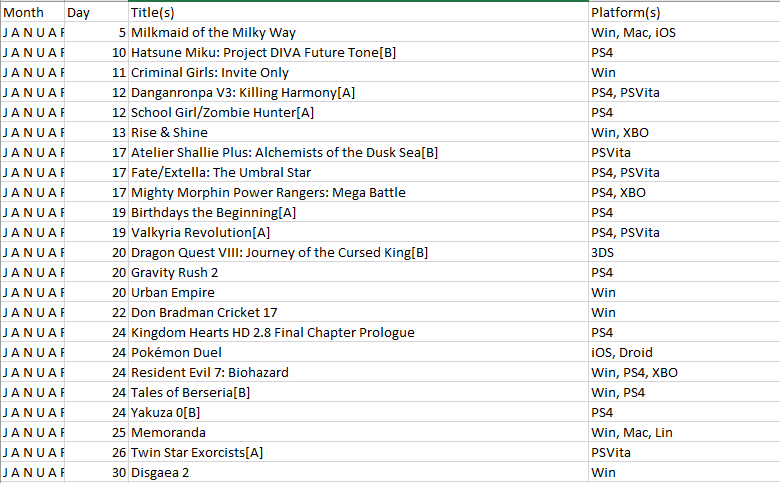

# PR18AH
# Vmesno poročilo projekta
kot sem napisal v osnutku bom naredil analizo igric od leta 2007 do 2017 in pogledal če se da videti kateri trendi so bili popularni in 
katere igrice so pripomogle h tem trendom. Trenutno imam na že spisek vseh igric, ki so pršle ven v tem obdobju, dan in mesec, ko so pršli ven in na katerih platformah. Ocene kritikov in uporabnikov pa imam iz kaggla. Trenutno nimam še nobenih grafov in analiz narejenih, vendar za končno poročilo bi predstavil trende, bi probal preveriti, če se da iz podatkov napovedovat trend, in koliko časa v povprečju trdajajo trendi.

* Trenutni podatki
           *Mesec izida igrice
           *Dan izida igrice
           *Ime Igrice
           *Platforme
           *Žanra
           *Ocene kritikov
           *Ocene Uporabnikov

  

